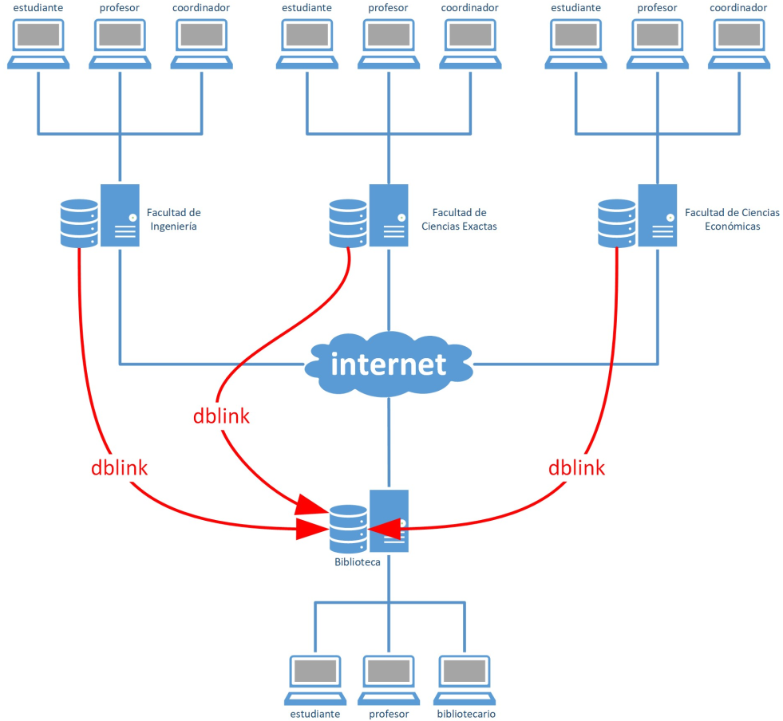

# University Distributed Database System
Version 1.0.0

## Table of Contents
1. [System Overview](#system-overview)
2. [Architecture](#architecture)
3. [Database Schemas](#database-schemas)
4. [Security Model](#security-model)
5. [Business Rules](#business-rules)
6. [Integration Points](#integration-points)
7. [Operational Procedures](#operational-procedures)
8. [Development Guidelines](#development-guidelines)
9. [Maintenance and Support](#maintenance-and-support)



## System Overview

The University Distributed Database System implements a comprehensive solution for managing academic and library operations across multiple faculties. The system utilizes PostgreSQL's distributed capabilities to create an integrated network of databases that share information while maintaining data integrity and security.

### Purpose

The system serves three primary objectives:
1. Managing academic operations including student enrollment, course administration, and grade tracking
2. Supporting library operations with book inventory and lending management
3. Facilitating cross-faculty resource sharing and academic coordination

### Scope

The system encompasses:
- Central library database with book management and lending operations
- Individual faculty databases managing academic programs
- Cross-database communication infrastructure
- Role-based access control system
- Automated user management

## Architecture

### Distributed System Design

The system implements a hub-and-spoke architecture where:
- The central library database serves as the hub
- Faculty databases operate as independent nodes
- Database links (dblink) facilitate inter-database communication
- Each node maintains its own security and user management

### Network Infrastructure

The implementation requires:
- High-availability database servers
- Secure network connections between nodes
- Load balancing for distributed queries
- Backup and recovery infrastructure

## Database Schemas

### Library Schema (biblioteca)

#### Domain Definitions
```sql
CREATE DOMAIN CODE_DOMAIN varchar(20) NOT NULL;
CREATE DOMAIN ID_DOMAIN integer NOT NULL;
CREATE DOMAIN NAME_DOMAIN varchar(100) NOT NULL;
CREATE DOMAIN NAME_DOMAIN_NULL varchar(100) NULL;
```

#### Core Tables

1. Person Management
```sql
CREATE TABLE tipo_identificacion (
    tipo CODE_DOMAIN,
    nombre NAME_DOMAIN,
    CONSTRAINT tipo_identificacion_PK PRIMARY KEY (tipo),
    CONSTRAINT tipo_identificacion_UQ UNIQUE (nombre)
);

CREATE TABLE persona (
    tipo_identificacion CODE_DOMAIN,
    identificacion CODE_DOMAIN,
    primer_nombre NAME_DOMAIN,
    segundo_nombre NAME_DOMAIN_NULL,
    primer_apellido NAME_DOMAIN,
    segundo_apellido NAME_DOMAIN_NULL,
    direccion varchar(100) NULL,
    telefono varchar(100) NULL,
    fecha_nacimiento date NULL,
    CONSTRAINT persona_PK PRIMARY KEY (identificacion),
    CONSTRAINT persona_2_tipo_identificacion_FK 
        FOREIGN KEY(tipo_identificacion) 
        REFERENCES tipo_identificacion(tipo)
);
```

2. Library Operations
```sql
CREATE TABLE libro (
    isbn CODE_DOMAIN,
    titulo NAME_DOMAIN,
    editorial NAME_DOMAIN,
    CONSTRAINT libro_PK PRIMARY KEY (isbn)
);

CREATE TABLE ejemplar (
    isbn CODE_DOMAIN,
    id ID_DOMAIN,
    CONSTRAINT ejemplar_PK PRIMARY KEY (isbn, id),
    CONSTRAINT ejemplar_2_libro_FK 
        FOREIGN KEY(isbn) 
        REFERENCES libro(isbn)
);

CREATE TABLE prestamo (
    isbn CODE_DOMAIN,
    id_ejemplar ID_DOMAIN,
    codigo_estudiante CODE_DOMAIN,
    fecha_prestamo timestamp NOT NULL DEFAULT now(),
    dias_prestamo integer NOT NULL DEFAULT 3,
    fecha_devolucion timestamp NULL,
    CONSTRAINT prestamo_PK 
        PRIMARY KEY (isbn, id_ejemplar, codigo_estudiante, fecha_prestamo),
    CONSTRAINT prestamo_2_ejemplar_FK 
        FOREIGN KEY(isbn, id_ejemplar) 
        REFERENCES ejemplar(isbn, id),
    CONSTRAINT prestamo_2_estudiante_FK 
        FOREIGN KEY(codigo_estudiante) 
        REFERENCES estudiante(codigo)
);
```

### Faculty Schema (facultad)

#### Domain Definitions
```sql
CREATE DOMAIN CODE_DOMAIN varchar(20) NOT NULL;
CREATE DOMAIN CODE_DOMAIN_NULL varchar(20) NULL;
CREATE DOMAIN ID_DOMAIN integer NOT NULL;
CREATE DOMAIN NAME_DOMAIN varchar(100) NOT NULL;
CREATE DOMAIN NAME_DOMAIN_NULL varchar(100) NULL;
CREATE DOMAIN SCORE_DOMAIN real NOT NULL DEFAULT 0;
```

#### Core Tables

1. Academic Programs
```sql
CREATE TABLE tipo_programa (
    tipo CODE_DOMAIN,
    nombre NAME_DOMAIN,
    CONSTRAINT tipo_programa_PK PRIMARY KEY (tipo),
    CONSTRAINT tipo_programa_UQ UNIQUE (nombre)
);

CREATE TABLE carrera (
    codigo CODE_DOMAIN,
    nombre NAME_DOMAIN,
    tipo CODE_DOMAIN,
    CONSTRAINT carrera_PK PRIMARY KEY (codigo),
    CONSTRAINT carrera_UQ UNIQUE (nombre),
    CONSTRAINT carrera_2_tipo_programa_FK 
        FOREIGN KEY(tipo) 
        REFERENCES tipo_programa(tipo)
);
```

2. Course Management
```sql
CREATE TABLE asignatura (
    codigo CODE_DOMAIN,
    nombre NAME_DOMAIN,
    creditos integer NOT NULL DEFAULT 3,
    CONSTRAINT asignatura_PK PRIMARY KEY (codigo),
    CONSTRAINT asignatura_UQ UNIQUE (nombre)
);

CREATE TABLE grupo (
    cod_carrera CODE_DOMAIN,
    cod_asignatura CODE_DOMAIN,
    periodo CODE_DOMAIN,
    grupo ID_DOMAIN,
    cupos integer NOT NULL DEFAULT 0,
    cod_profesor CODE_DOMAIN_NULL,
    CONSTRAINT grupo_PK 
        PRIMARY KEY (cod_carrera, cod_asignatura, periodo, grupo),
    CONSTRAINT grupo_2_oferta_asignatura_FK 
        FOREIGN KEY(cod_carrera, cod_asignatura, periodo) 
        REFERENCES oferta_asignatura(cod_carrera, cod_asignatura, periodo)
);
```

## Security Model

### Role-Based Access Control

1. Coordinator Role (role_coordinador)
```sql
GRANT USAGE ON SCHEMA facultad TO role_coordinador;
GRANT SELECT, INSERT, UPDATE, DELETE ON facultad.persona TO role_coordinador;
GRANT SELECT, INSERT, UPDATE, DELETE ON facultad.estudiante TO role_coordinador;
```

2. Professor Role (role_profesor)
```sql
GRANT USAGE ON SCHEMA facultad TO role_profesor;
GRANT SELECT ON facultad.inscripcion TO role_profesor;
GRANT UPDATE (nota1, nota2, nota3) ON facultad.inscripcion TO role_profesor;
```

3. Student Role (role_estudiante)
```sql
GRANT USAGE ON SCHEMA facultad TO role_estudiante;
GRANT SELECT ON facultad.inscripcion TO role_estudiante;
GRANT SELECT ON facultad.NotasPorEstudiante TO role_estudiante;
```

### Automated User Management

```sql
CREATE FUNCTION trg_AI_estudiante()
RETURNS TRIGGER AS $$
BEGIN
    EXECUTE 'CREATE USER "' || NEW.codigo || '" WITH PASSWORD ''' || NEW.codigo || '''';
    EXECUTE 'GRANT role_estudiante to "' || NEW.codigo || '";';
    RETURN NEW;
END;
$$ LANGUAGE plpgsql;
```

## Business Rules

### Enrollment Controls

```sql
CREATE FUNCTION facultad.trg_control_inscripcion() 
RETURNS TRIGGER AS $$
DECLARE
    cupos_grupo INTEGER;
    inscritos_grupo INTEGER;
BEGIN
    SELECT cupos INTO STRICT cupos_grupo
    FROM facultad.grupo gru
    WHERE gru.cod_carrera = new.cod_carrera 
    AND gru.cod_asignatura = new.cod_asignatura 
    AND gru.periodo = new.periodo 
    AND gru.grupo = new.grupo;
    
    -- Additional enrollment validation logic
END;
$$ LANGUAGE plpgsql;
```

### Library Lending Rules

```sql
CREATE FUNCTION biblioteca.prestar_libro(
    isbn varchar(20),
    id_ejemplar INTEGER,
    codigo_estudiante varchar(20),
    dias_prestamo integer
) RETURNS integer AS $$
BEGIN
    INSERT INTO biblioteca.prestamo(
        isbn, id_ejemplar, codigo_estudiante, 
        fecha_prestamo, dias_prestamo
    ) 
    VALUES(
        isbn, id_ejemplar, codigo_estudiante, 
        now(), dias_prestamo
    );
    RETURN 0;
END;
$$ LANGUAGE plpgsql;
```

## Integration Points

### Cross-Database Views

```sql
CREATE VIEW facultad.DisponibilidadLibros AS
SELECT *
FROM dblink(
    'dbname=biblioteca', 
    'select * from biblioteca.DisponibilidadLibros'
)
AS t1 (
    isbn CODE_DOMAIN,
    titulo NAME_DOMAIN,
    editorial NAME_DOMAIN,
    nombre NAME_DOMAIN,
    id ID_DOMAIN
);
```

## Operational Procedures

### Regular Maintenance Tasks

The system requires regular maintenance procedures:
1. Database optimization and cleanup
2. User permission audits
3. Performance monitoring
4. Backup verification

### Backup Strategy

Implementation of a comprehensive backup strategy including:
1. Daily full database backups
2. Transaction log backups every hour
3. Cross-database consistency checks
4. Regular restore testing

## Development Guidelines

### Coding Standards

1. Naming Conventions
- Use snake_case for database objects
- Prefix triggers with trg_
- Prefix functions with their schema name

2. Documentation Requirements
- Inline comments for complex logic
- Function header documentation
- Change log maintenance

### Version Control

The system uses semantic versioning:
- Major version: Incompatible API changes
- Minor version: Backwards-compatible functionality
- Patch version: Backwards-compatible bug fixes

## Maintenance and Support

### Monitoring

The system requires monitoring of:
1. Database link health
2. Query performance
3. Resource utilization
4. Security events

### Troubleshooting Procedures

Standard procedures for:
1. Database link failures
2. Performance issues
3. Security incidents
4. Data consistency problems

This documentation provides a comprehensive overview of the University Distributed Database System. For specific implementation details or customization requirements, please consult the development team or system administrator.